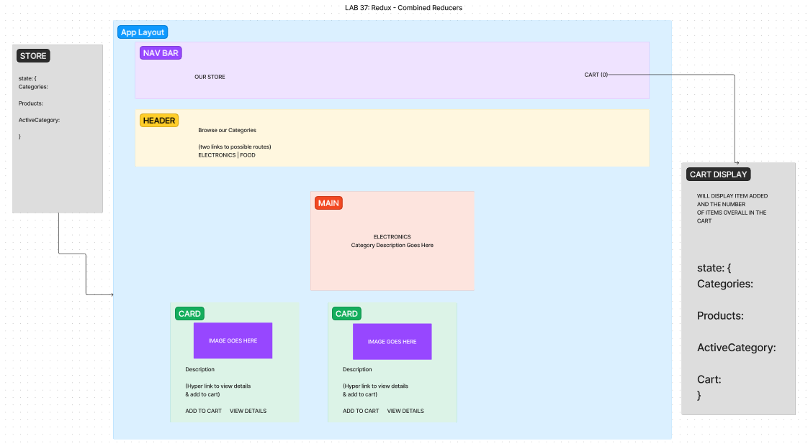

# LAB - Class 36

## Project: Application State with Redux

### Author: Reece Renninger

### Problem Domain  

Today, we begin the first of a 4-Phase build of the storefront application, written in React. In this first phase, our goal is to setup the basic scaffolding of the application with initial styling and basic behaviors. This initial build sets up the file structure and state management so that we can progressively build this application in a scalable manner.

The following user/developer stories detail the major functionality for this phase of the project.

    As a user, I expect to see a list of available product categories in the store so that I can easily browse products.
    As a user, I want to choose a category and see a list of all available products matching that category.
    As a user, I want a clean, easy to use user interface so that I can shop the online store with confidence.

### Links and Resources

- [GitHub Actions ci/cd](https://github.com/ReeceRenninger/storefront/actions)
- [front-end application](https://codesandbox.io/p/github/ReeceRenninger/storefront/redux?layout=%257B%2522sidebarPanel%2522%253A%2522EXPLORER%2522%252C%2522rootPanelGroup%2522%253A%257B%2522direction%2522%253A%2522horizontal%2522%252C%2522type%2522%253A%2522PANEL_GROUP%2522%252C%2522id%2522%253A%2522ROOT_LAYOUT%2522%252C%2522panels%2522%253A%255B%257B%2522type%2522%253A%2522PANEL_GROUP%2522%252C%2522direction%2522%253A%2522horizontal%2522%252C%2522id%2522%253A%2522EDITOR%2522%252C%2522panels%2522%253A%255B%257B%2522type%2522%253A%2522PANEL%2522%252C%2522panelType%2522%253A%2522TABS%2522%252C%2522id%2522%253A%2522cljrv0d9n00ct2a6eaj2mx3gn%2522%257D%255D%252C%2522sizes%2522%253A%255B100%255D%257D%252C%257B%2522type%2522%253A%2522PANEL_GROUP%2522%252C%2522direction%2522%253A%2522horizontal%2522%252C%2522id%2522%253A%2522DEVTOOLS%2522%252C%2522panels%2522%253A%255B%257B%2522type%2522%253A%2522PANEL%2522%252C%2522panelType%2522%253A%2522TABS%2522%252C%2522id%2522%253A%2522cljrv0d9n00cv2a6ek6zwc0uj%2522%257D%255D%252C%2522sizes%2522%253A%255B100%255D%257D%255D%252C%2522sizes%2522%253A%255B50%252C50%255D%257D%252C%2522tabbedPanels%2522%253A%257B%2522cljrv0d9n00ct2a6eaj2mx3gn%2522%253A%257B%2522tabs%2522%253A%255B%257B%2522id%2522%253A%2522cljrv0d9n00cs2a6e1q0ddw1i%2522%252C%2522mode%2522%253A%2522permanent%2522%252C%2522type%2522%253A%2522FILE%2522%252C%2522filepath%2522%253A%2522%252FREADME.md%2522%257D%255D%252C%2522id%2522%253A%2522cljrv0d9n00ct2a6eaj2mx3gn%2522%252C%2522activeTabId%2522%253A%2522cljrv0d9n00cs2a6e1q0ddw1i%2522%257D%252C%2522cljrv0d9n00cv2a6ek6zwc0uj%2522%253A%257B%2522id%2522%253A%2522cljrv0d9n00cv2a6ek6zwc0uj%2522%252C%2522tabs%2522%253A%255B%257B%2522type%2522%253A%2522TASK_LOG%2522%252C%2522taskId%2522%253A%2522dev%2522%252C%2522id%2522%253A%2522cljrv0idm00l02a6eg5sbtiww%2522%252C%2522mode%2522%253A%2522permanent%2522%257D%255D%252C%2522activeTabId%2522%253A%2522cljrv0idm00l02a6eg5sbtiww%2522%257D%257D%252C%2522showDevtools%2522%253Atrue%252C%2522showSidebar%2522%253Atrue%252C%2522sidebarPanelSize%2522%253A15%257D) (when applicable)

### Collaborators

- Sir Ike, The Honorable Nick, The Jester Ryan on the whole lab

### Setup

#### `.env` requirements (where applicable)

for now I have none and do not require one

#### How to initialize/run your application (where applicable)

- e.g. `npm start`

#### How to use your library (where applicable)

#### Features / Routes

- Display products from pre generated state in a redux store that can be changed by user clicks on the categories.

#### Tests

- npm test

#### UML

\\\\\\\\\\\\\\\\\\\\\\\\\\\\\\\\\\\\\\\\\\\\\\\\\\\\\\\\\\\\\\\\\\\\\\\\\\\\\\\\\\\\\\\\\\\\\\\\\\\\\\\\\\\\\\\\\\\\\\\\\\\\\\\\\\\\\\\\\\\\\\\\\\\\\\

# LAB - Class 37

## Project: Redux - Combined Reducers

### Author: Reece Renninger

### Problem Domain  

In phase 2, we will be adding the “Add to Cart” feature to our application, which will allow our users to not only browse items in the store, but also select them and have them persist in their “shopping cart” for later purchase.

The user stories from Phase 1 remain unchanged. For this phase, we are now adding the following new user stories to meet the new requirements.

    As a user, I want to choose from products in the list and add them to my shopping cart.
    As a user, I want to see the products that I’ve added to my shopping cart in a growing list on the side of the page”.
    As a user, I want to change the quantity of items I intend to purchase in the header. i.e. CART (1)
    As a user, I want to be able to remove an item from my shopping cart.

### Links and Resources

- [GitHub Actions ci/cd](https://github.com/ReeceRenninger/storefront/actions)
- [front-end application]() (when applicable)

### Collaborators

- Sir Ike, The Honorable Nick, The Jester Ryan on the whole lab

### Setup

#### `.env` requirements (where applicable)

for now I have none and do not require one

#### How to initialize/run your application (where applicable)

- e.g. `npm start`

#### How to use your library (where applicable)

#### Features / Routes

- Display products from pre generated state in a redux store that can be changed by user clicks on the categories.
- Allow users to add products to a cart and display the number of items in cart and what is in the cart.

#### Tests

- npm test

#### UML

